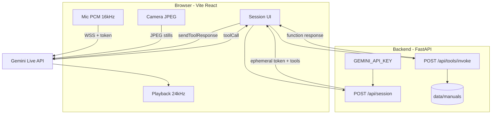
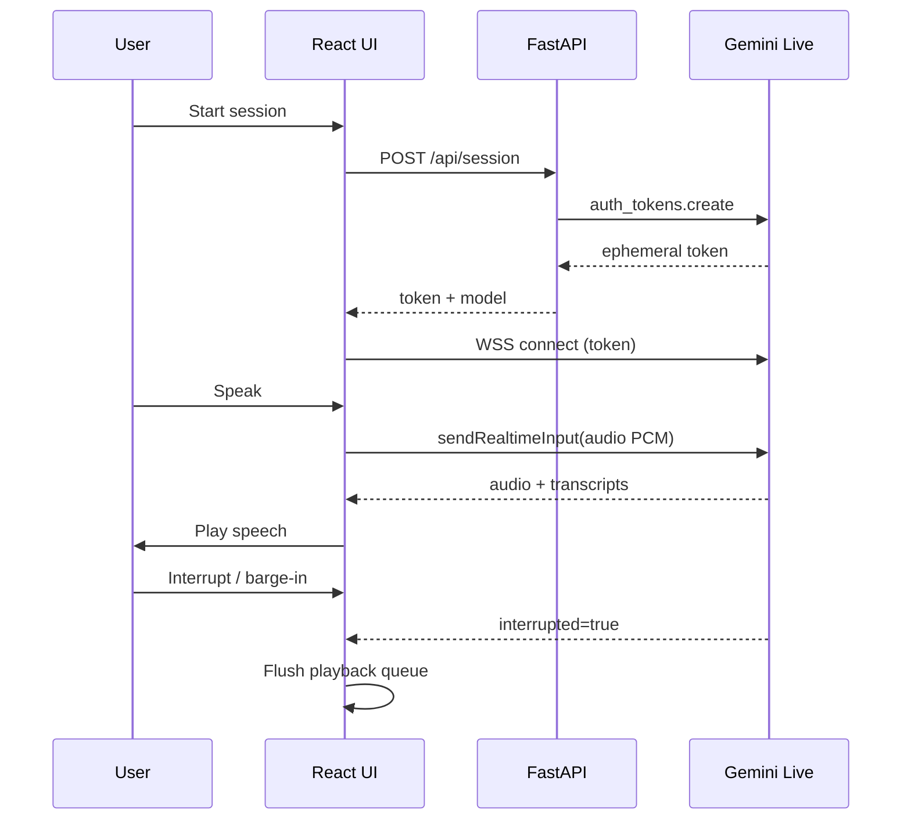
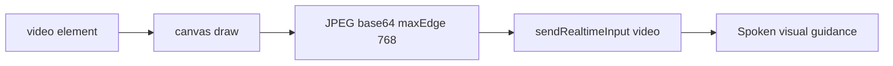
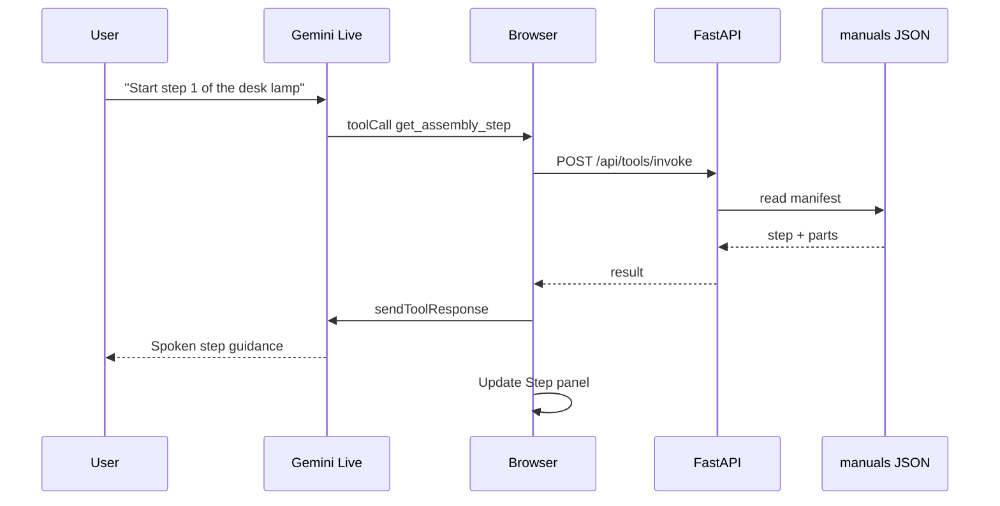
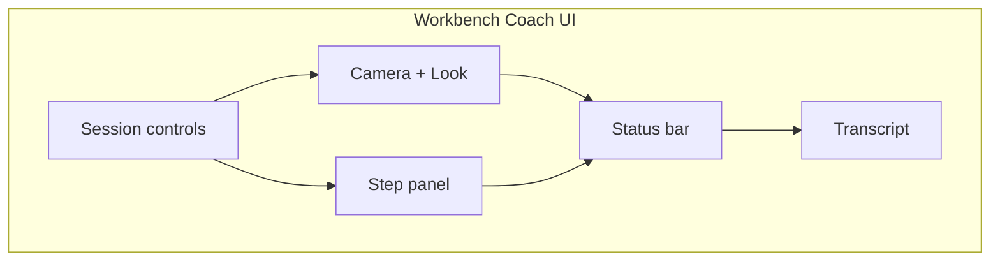

# Multimodal Real-Time Assembly Assistant

A low-latency **voice + vision** assistant that watches a workbench (via sparse camera stills), listens over the mic, and guides hardware assembly using grounded kit manuals.

Built on **Gemini Live** with a thin Python backend that mints **ephemeral tokens** and serves **local manuals** through function calling. The API key never reaches the browser.

---

## Why this project

| Challenge | Approach |
|-----------|----------|
| Sub-second spoken interaction | Native Gemini Live speech-to-speech (not STT → LLM → TTS) |
| Situational awareness | JPEG keyframes (Look / ~1 FPS), not fake continuous video |
| Trustworthy steps | Tool-backed manuals (`desk_lamp_mini`) instead of free-form hallucination |
| Secure browser demos | Ephemeral tokens; media goes client → Gemini directly |

**Demo vertical:** hardware assembly coaching (Desk Lamp Mini kit). The same pipeline can power other multimodal live products (see [Possible application UIs](#possible-application-uis)).

---

## Current status

| Phase | Focus | Status |
|-------|--------|--------|
| **1** | Voice loop + ephemeral session | Done |
| **2** | Camera stills (Look / ~1 FPS) | Done |
| **3** | Kit manuals + Live tools + step panel | Done |
| **4** | Session resume, GoAway, cost guards, polish | Planned |

---

## High-level architecture



**Latency path:** mic/camera stay on the browser → Gemini hop. The backend is only for auth and grounded tools.

---

## Tech stack

| Layer | Choice | Role |
|-------|--------|------|
| Backend | Python 3.11+, FastAPI, Uvicorn | Session tokens, manuals, tools |
| AI SDK | `google-genai` | Ephemeral Live tokens |
| Frontend | Vite, React 18, TypeScript | UI + media capture |
| Live client | `@google/genai/web` | WebSocket Live session |
| Audio | Web Audio API | 16 kHz PCM in / 24 kHz out, barge-in flush |
| Vision | Canvas → JPEG | Downscaled stills (max edge 768) |
| Data | JSON manifests | Local kit manuals |

**Explicitly out of v1:** Deepgram / ElevenLabs chains, custom WebRTC SFU, Pipecat/LiveKit, user auth DB.

---

## Repository layout

```text
multimodel-real-time-assistant/
├── README.md
├── .env.example
├── backend/
│   ├── app/
│   │   ├── main.py                 # FastAPI app
│   │   ├── config.py
│   │   ├── api/                    # health, session, tools
│   │   ├── prompts/assembly_coach.py
│   │   ├── services/               # tokens, manuals
│   │   └── tools/                  # definitions + handlers
│   └── data/manuals/desk_lamp_mini/
└── frontend/
    └── src/
        ├── App.tsx
        ├── api/
        ├── audio/                  # capture + playback
        ├── vision/                 # JPEG frames
        ├── live/                   # Live client + toolsBridge
        └── components/             # controls, camera, step, transcript
```

---

## Phase roadmap (detailed)

### Phase 1 — Voice skeleton

**Goal:** Start a session, speak, hear Aria, interrupt mid-sentence. API key stays on the server.

**Delivered**
- `POST /api/session` mints a Gemini Live ephemeral token (`v1alpha`)
- System persona: Aria, hardware assembly coach
- Browser Live connect with mic → PCM chunks (~40 ms)
- Streaming TTS playback + barge-in buffer flush
- Input/output transcriptions in the UI
- Context window compression enabled



**Done when:** Conversational voice works in Chrome with Start/Stop and barge-in.

---

### Phase 2 — Vision

**Goal:** Aria can see sparse stills of the workbench for orientation and part context.

**Delivered**
- Camera preview via `getUserMedia`
- **Look** — on-demand JPEG keyframe
- **Continuous (~1 FPS)** — optional while assembling
- Frames downscaled before send
- Prompt updates: describe what matters, ask to reframe if unclear
- Look nudge text so Aria reacts without waiting for speech



**Done when:** “What am I looking at?” / orientation questions get vision-grounded answers.

---

### Phase 3 — Tools + manuals

**Goal:** Step guidance is grounded in a real kit manual, not invented.

**Delivered**
- Sample kit: **Desk Lamp Mini** (`desk_lamp_mini`) — 5 steps, 8 parts
- Tools declared on the Live session:
  - `list_manuals`
  - `get_assembly_step`
  - `lookup_part`
  - `get_checklist`
- `POST /api/tools/invoke` executes tools against local JSON
- Frontend `toolsBridge` + Live `sendToolResponse`
- **Current step** sidebar updated from tool results



**Done when:** End-to-end guided assembly of Desk Lamp Mini with tool-backed steps and a live step panel.

---

### Phase 4 — Hardening (planned)

**Goal:** Longer, safer sessions suitable for demos and early production.

| Item | Intent |
|------|--------|
| Session resumption | Survive WebSocket resets without losing context |
| `GoAway` handling | Graceful reconnect before server drop |
| Frame / session caps | Control cost on continuous vision |
| Reconnect UI | Clear status when the Live socket flaps |
| Optional Docker Compose | One-command local stack |
| Logging | Tool calls, session length, errors |

---

## Possible application UIs

The same core pipeline (Live audio + optional frames + tools) can power several product surfaces. Below are UI concepts — **A** is what we ship today; others are natural extensions.

### A. Workbench coach (current)

Assembly desk: camera on the left, live step card on the right, transcript below.

```text
┌─────────────────────────────────────────────────────────────┐
│  Assembly Assistant                          [Start] [Stop] │
├──────────────────────────────┬──────────────────────────────┤
│                              │  CURRENT STEP                │
│     ┌──────────────────┐     │  Desk Lamp Mini Kit          │
│     │                  │     │  Step 3: Wire the socket     │
│     │  Camera preview  │     │  Attach leads under L and N… │
│     │                  │     │  Parts: Bulb socket, Cable   │
│     └──────────────────┘     │  Tip: no copper whiskers     │
│     [Look]  [~1 FPS ☐]       │  Last tool: get_assembly_step│
├──────────────────────────────┴──────────────────────────────┤
│  Status: Listening — speak, Look, or ask for a step         │
├─────────────────────────────────────────────────────────────┤
│  You:  What's next after the stem is locked?                │
│  Aria: Step 2 — route the cable up through the stem…        │
└─────────────────────────────────────────────────────────────┘
```



---

### B. Field technician HUD (tablet / AR-light)

Hands-busy repair: large camera, tiny floating next-action, push-to-talk.

```text
┌──────────────────────────────────────────┐
│ ████████████ CAMERA FULL BLEED █████████ │
│                                          │
│   ┌─────────────────────────────┐        │
│   │ NEXT: Torque flange M8 12Nm │        │
│   │ Part: Gasket-A · Tool: T30  │        │
│   └─────────────────────────────┘        │
│                                          │
│         (  HOLD TO TALK  )               │
│              [LOOK]                      │
└──────────────────────────────────────────┘
```

**Fits when:** outdoor/plant floor, gloves on, glanceable instructions.

---

### C. Interactive code reviewer (future vertical)

Screen share / IDE window as “vision”; tools hit repo files / lint / tests.

```text
┌─────────────────────────┬───────────────────┐
│                         │  Review focus     │
│   Screen / editor feed  │  auth.ts:42       │
│                         │  Missing null     │
│                         │  check on userId  │
├─────────────────────────┴───────────────────┤
│  ▶ Speak review · [Capture frame] · Diff   │
│  Transcript of spoken code review…          │
└─────────────────────────────────────────────┘
```

**Tools would swap to:** `get_file_snippet`, `run_linter`, `list_changed_files`.

---

### D. Training simulator (classroom)

Instructor broadcast + student checklist progress.

```text
┌──────────────┬────────────────────────────┐
│ Instructor   │ Students                   │
│ live view    │ ████░░░░  Step 2 of 5      │
│ + voice      │ Ava · done 2 · stuck step 3│
│              │ Sam · done 4               │
└──────────────┴────────────────────────────┘
```

**Needs Phase 4+:** multi-session orchestration, shared room state.

---

### E. Voice-only kiosk (no camera)

Reception / accessibility mode: large transcript, big Start, no vision cost.

```text
┌─────────────────────────────────────┐
│           ARIA  ·  HELP DESK        │
│                                     │
│     “How do I reset my badge?”      │
│                                     │
│         ● ● ●  listening            │
│                                     │
│         [  TAP TO TALK  ]           │
└─────────────────────────────────────┘
```

**Fits when:** privacy-sensitive spaces or devices without cameras.

---

### UI capability matrix

| Surface | Voice | Vision | Manual tools | Multi-user |
|---------|-------|--------|--------------|------------|
| A Workbench coach | Yes | Yes | Yes | No |
| B Field HUD | Yes | Yes | Yes | No |
| C Code reviewer | Yes | Screen | Repo tools | Optional |
| D Training room | Yes | Optional | Yes | Yes |
| E Voice kiosk | Yes | No | FAQ tools | No |

---

## Setup

### 1. Environment

```bash
cp .env.example backend/.env
# Set GEMINI_API_KEY=
# Optionally set GEMINI_LIVE_MODEL=...
```

| Variable | Purpose |
|----------|---------|
| `GEMINI_API_KEY` | Server-only Gemini key |
| `GEMINI_LIVE_MODEL` | Live model id |
| `CORS_ORIGINS` | Default `http://localhost:5173` |
| `PORT` | Backend port (default `8000`) |

### 2. Backend

```bash
cd backend
python -m venv .venv
# Windows:
.venv\Scripts\activate
pip install -r requirements.txt
uvicorn app.main:app --reload --port 8000
```

### 3. Frontend

```bash
cd frontend
npm install
npm run dev
```

Open http://localhost:5173 → **Start session** → allow **microphone + camera**.

### 4. Demo script

1. Start session.
2. Confirm Aria lists the **Desk Lamp Mini** kit.
3. Ask for **step 1**; watch the step panel fill.
4. Tap **Look** with parts on the desk; ask if orientation looks right.
5. Ask “what is the shade ring?” → `lookup_part`.
6. Ask “how far am I?” → `get_checklist`.

---

## API reference

| Method | Path | Purpose |
|--------|------|---------|
| `GET` | `/health` | Liveness |
| `POST` | `/api/session` | Ephemeral Live token + tool declarations |
| `GET` | `/api/tools/definitions` | Function schemas |
| `POST` | `/api/tools/invoke` | Execute a tool against local manuals |

### Example tool invoke

```http
POST /api/tools/invoke
Content-Type: application/json

{
  "name": "get_assembly_step",
  "args": {
    "manual_id": "desk_lamp_mini",
    "step_number": 1
  }
}
```

---

## Data model (kit manuals)

Each kit lives under `backend/data/manuals/<kit_id>/`:

| File | Role |
|------|------|
| `manifest.json` | Source of truth: parts, steps, safety |
| `steps.md` | Human-readable mirror |

To add a kit: drop a new folder with `manifest.json` matching the Desk Lamp Mini shape; `list_manuals` will pick it up automatically (process restart / cache clear if needed).

---

## Operational notes

- **Vite proxy:** Restart `npm run dev` after `vite.config.ts` changes. If `/api/session` returns HTML or 404 from port 5173, the proxy is stale.
- **Port 8000 busy:** Windows may report `WinError 10013` when the port is already taken — free it or use another port.
- **Browser:** Prefer Chrome for mic/camera demos.
- **Cost:** Continuous ~1 FPS burns tokens; prefer **Look** for demos.
- **Model id:** If connect fails, update `GEMINI_LIVE_MODEL` to a current Live model from [Google Live docs](https://ai.google.dev/gemini-api/docs/live-api).

---

## License / key safety

- Do not commit `backend/.env` or real API keys.
- Ephemeral tokens expire quickly and are constrained to Live sessions — still treat them as secrets in logs.
